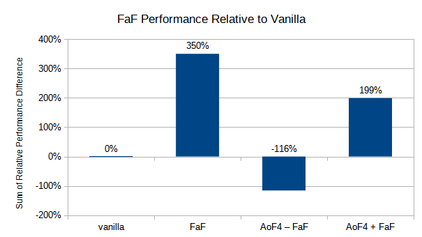

# Fast as Fabric

Fast, efficient, and optimized Fabric modpack built for minimum lag and maximum performance

This modpack serves as a base for other modpacks, or as a simple solution for maximum performance in vanilla Minecraft. It was inspired by [optifine_alternatives](https://gist.github.com/LambdAurora/1f6a4a99af374ce500f250c6b42e8754) and [fabulously-optimized](
https://www.curseforge.com/minecraft/modpacks/fabulously-optimized) with a focus of validating claims through benchmarks and removing unnecessary mods. 

Try it out here: https://www.curseforge.com/minecraft/modpacks/fast-as-fabric

## Mods

### Verified

Included mods that have been verified in our benchmarks to provide at least a 10% overall performance uplift or 5% in any specific scenario.

- [Clumps](https://www.curseforge.com/minecraft/mc-mods/clumps)
- [Recipe Cache](https://www.curseforge.com/minecraft/mc-mods/recipe-cache)
- [Lazy DFU](https://www.curseforge.com/minecraft/mc-mods/lazydfu)
- [C2ME](https://github.com/ishlandbukkit/C2ME-fabric)
- [Starlight](https://github.com/Spottedleaf/Starlight)
- [Hydrogen](https://modrinth.com/mod/hydrogen)
- [FerriteCore](https://www.curseforge.com/minecraft/mc-mods/ferritecore-fabric)
- [Lithium](https://www.curseforge.com/minecraft/mc-mods/lithium)
- [Sodium](https://www.curseforge.com/minecraft/mc-mods/sodium) (client only)
- [Sodium Extra](https://www.curseforge.com/minecraft/mc-mods/sodium-extra) (client only)
- [No Fade](https://www.curseforge.com/minecraft/mc-mods/no-fade) (client only)
- [EntityCulling](https://www.curseforge.com/minecraft/mc-mods/entityculling) (client only)
- [Client Side Noteblocks](https://www.curseforge.com/minecraft/mc-mods/client-side-noteblocks) (client only)

Depends on:

- [Fabric](https://fabricmc.net/)
- [Fabric API](https://www.curseforge.com/minecraft/mc-mods/fabric-api)

### Unverified

Mods that claim to improve performance, but have yet to be verified by us. These are in consideration to be added but require further testing.

- [Krypton](https://www.curseforge.com/minecraft/mc-mods/krypton)

### Extras

Mods that have been proven to increase performance but they apply in a way that most people may not want or expect. These are not included in the modpack.

- [Overworld Two](https://www.curseforge.com/minecraft/mc-mods/overworld-two)
    - completely changes vanilla terrain generation
- [Enhanced Block Entities](https://modrinth.com/mod/ebe) (client only)
    - can be used without Indium but results in small graphical artifacts
    - add EBE-supported blocks to entity culling config whitelist to avoid extra path tracing
    - [Indium](https://github.com/comp500/Indium) (client only) is currently bugged causing FPS to be halved
- [Smoke Suppression](https://www.curseforge.com/minecraft/mc-mods/smoke-suppression) (client only)
    - not applicable on lowest settings
- [Cull Leaves](https://www.curseforge.com/minecraft/mc-mods/cull-leaves) (client only)
    - not applicable on lowest settings

### Removed

Mods that are not present within this pack due to inferiority, lack of compatibility, or lack of stability.

- [Fat Experience Orbs](https://www.curseforge.com/minecraft/mc-mods/fat-experience-orbs)
    - replaced by Clumps
- [Simplex Terrain Generation](https://www.curseforge.com/minecraft/mc-mods/simplex-terrain-generation)
    - inferior to Overworld Two
- [Fast Furnace](https://www.curseforge.com/minecraft/mc-mods/fast-furnace-for-fabric)
    - inferior to Recipe Cache and Enhanced Block Entities
- [FastBench](https://www.curseforge.com/minecraft/mc-mods/fastbench-for-fabric)
    - inferior to Recipe Cache
- [Phosphor](https://www.curseforge.com/minecraft/mc-mods/phosphor)
    - inferior to Starlight
- [Foam​Fix](https://www.curseforge.com/minecraft/mc-mods/foamfix-optimization-mod)
    - incompatible version
- [DashLoader](https://www.curseforge.com/minecraft/mc-mods/dashloader) (client only)
    - incompatible with Sodium and Hydrogen
- [OptiFabric](https://www.curseforge.com/minecraft/mc-mods/optifabric) (client only)
    - incompatible with Sodium
- [FastChest](https://www.curseforge.com/minecraft/mc-mods/fastchest) (client only)
    - inferior to Enhanced Block Entities
- [Better Beds](https://www.curseforge.com/minecraft/mc-mods/better-beds) (client only)
    - inferior to Enhanced Block Entities
- [No Weather Effects](https://www.curseforge.com/minecraft/mc-mods/no-weather-effects) (client only)
    - inferior to Sodium Extras
- [Dynamic FPS](https://www.curseforge.com/minecraft/mc-mods/dynamic-fps) (client only)
    - slows down texture loading

## Benchmarking

Raw results are available in the `benchmarks` directory. The following setting were used:

- fullscreen
- 4GB RAM allocated
- max FoV (Quake Pro)
- vsync off
- max framerate unlimited
- render distance 8
- peaceful
- creative
- all other settings are set to lowest unless specified.

A world is created using seed [`2151901553968352745`](https://www.reddit.com/r/Minecraft/hthrmk) and baseline settings are configured. After 2 minutes a baseline image created and cloned for each benchmark. All benchmarks are performed 2 minutes after loading into the world.

Benchmarking was done using the following tools:

- [MultiMC](https://multimc.org)
- [Carpet](https://www.curseforge.com/minecraft/mc-mods/carpet)
- [Fabric Chunk Pregenerator](https://www.curseforge.com/minecraft/mc-mods/chunk-pregenerator-fabric)

Testing methodology and data presentation inspired by:

- [Phoronix](https://www.phoronix.com)
- [Gamers Nexus](https://www.gamersnexus.net)
- [Krausest Web UI Framework Benchmark](https://krausest.github.io/js-framework-benchmark)
- [TechEmpower Web Framework Benchmark](https://www.techempower.com/benchmarks)

### Hardware

- Intel i7 6700
- Nvidia GTX 1060 3GB
- 16GB DDR4 (4GB allocated)

### Glossary

**rdp**

- relative delta percentage
- measurement / baseline - 1 * 100%

**fps**

- average frames per second
- measurement of understanding visual smoothness

**tps**

- average ticks per second
- measurement of server smoothness and responsiveness
- `/tick warp 10000`

**cgps**

- average chunks generated per second
- measurement of server and world generation smoothness while exploring
- pause game after starting pregen (escape menu) to stop server ticks from consuming CPU time
- manually timed
- =10000/(time)
- `/pregen start 50`

**ram**

- memory usage in MB
- singleplayer reflects client + server usage

**rdp sum**

- sum of relative deltas as a percentage
- used to determine overall impact of the mod

## Notes

- Sodium entity culling is disabled as it's done more aggressively by the EntityCulling mod

Additional settings to improve server performance:

- in game `/gamerule disableElytraMovementCheck true`
- in server.properties `allow-flight=true`
- in server.properties `use-native-transport=true` use only on Linux servers
- in server.properties `view-distance=8` less than 8 can affect mob despawn behavior