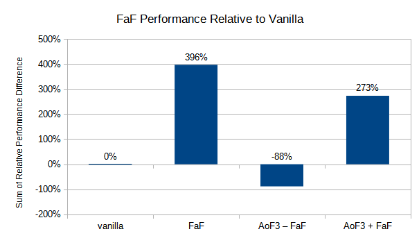

# FastAsFabric

Fast, efficient, and optimized modpack built for minimum lag and maximum performance

This modpack serves as a base for other modpacks, or as a simple solution for maximum performance in vanilla Minecraft. It was inspired by [optifine_alternatives](https://gist.github.com/LambdAurora/1f6a4a99af374ce500f250c6b42e8754) and [fabulously-optimized](
https://www.curseforge.com/minecraft/modpacks/fabulously-optimized) with a focus of validating claims through benchmarks and removing unnecessary mods. 

## Mods

### Benchmark Verified

Mods that have been verified in our benchmarks to provide at least a 10% overall performance uplift.

- [Sodium](https://www.curseforge.com/minecraft/mc-mods/sodium)
- [Lithium](https://www.curseforge.com/minecraft/mc-mods/lithium)
- [Phosphor](https://www.curseforge.com/minecraft/mc-mods/phosphor)
- [No Fade](https://www.curseforge.com/minecraft/mc-mods/no-fade)
- [FerriteCore](https://modrinth.com/mod/ferrite-core)
- [Hydrogen](https://modrinth.com/mod/hydrogen)
- [Fat Experience Orbs](https://www.curseforge.com/minecraft/mc-mods/fat-experience-orbs)
- [Fast Furnace](https://www.curseforge.com/minecraft/mc-mods/fast-furnace-for-fabric)
- [Cull Leaves](https://www.curseforge.com/minecraft/mc-mods/cull-leaves)
- [EntityCulling](https://www.curseforge.com/minecraft/mc-mods/entityculling)

Depends on:

- [Fabric](https://fabricmc.net/)
- [Fabric API](https://www.curseforge.com/minecraft/mc-mods/fabric-api)
- [Indium](https://github.com/comp500/Indium)

### Verified

Mods that have been verified by us to improve performance outside of our benchmarks in hard to test or niche scenarios.

- [FastBench](https://www.curseforge.com/minecraft/mc-mods/fastbench-for-fabric)

### Unverified

Mods that claim to improve performance, but have yet to be verified by us. These are only present within beta releases of this modpack.

- [Krypton](https://www.curseforge.com/minecraft/mc-mods/krypton)

### Gameplay Altering

Mods that have been proven to increase performance but they alter gameplay in a way that most people may not want or expect. These are not included in the modpack.

- [Simplex Terrain Generation](https://www.curseforge.com/minecraft/mc-mods/simplex-terrain-generation)
    - completely changes vanilla terrain generation
- [Enhanced Block Entities](https://modrinth.com/mod/ebe)
    - Requires patched version of Sodium
    - Depends on Indium
    - Add EBE-supported blocks to EntityCulling config whitelist to avoid extra path tracing

### Removed

Mods that are not present within this pack due to not improving performance, lack of compatibility, or lack of stability.

- [Dynamic FPS](https://www.curseforge.com/minecraft/mc-mods/dynamic-fps)
    - slows down texture loading
- [Foam​Fix](https://www.curseforge.com/minecraft/mc-mods/foamfix-optimization-mod)
    - incompatible version
- [OptiFabric](https://www.curseforge.com/minecraft/mc-mods/optifabric)
    - incompatible with Sodium
- [FastChest](https://www.curseforge.com/minecraft/mc-mods/fastchest)
    - overlaps Enhanced Block Entities
- [Fast Redstone](https://modrinth.com/mod/fast-redstone)
    - not ready for use

## Benchmarking

Raw results are available in the `benchmarks` directory. The following setting were used:

- launched offline
- fullscreen
- max FoV (Quake Pro)
- vsync off
- max framerate unlimited
- render distance 10
- spectator
- peaceful
- all other settings are left on default unless specified.

Benchmarking was done using the following tools:

- [MultiMC](https://multimc.org)
- [Carpet](https://www.curseforge.com/minecraft/mc-mods/carpet)
- [Fabric Chunk Pregenerator](https://www.curseforge.com/minecraft/mc-mods/chunk-pregenerator-fabric)

Testing methodology and data presentation inspired by:

- [Phoronix](https://www.phoronix.com)
- [Gamers Nexus](https://www.gamersnexus.net)
- [Krausest Web UI Framework Benchmark](https://krausest.github.io/js-framework-benchmark)
- [TechEmpower Web Framework Benchmark](https://www.techempower.com/benchmarks)

### Hardware

- Intel i7 6700
- Nvidia GTX 1060 3GB
- 16GB DDR4 (4GB allocated)

### Standard Bench

The bench world is first randomly generated where spawn has a decent amount of trees. It is then filled evenly with various stress blocks in a 3 chunk radius around the desired test location. These blocks are:

- 16 pistons powered by 1 tick comparator clocks
- 64 torches
- 64 cobblestone wall
- 16 smelting furnaces
- 64 chests

The player is then moved to a location and angle such that some of the items are not in field of view. Afterwards, entities are spawned 2 blocks above the player using the following commands:

- `/give @p minecraft:repeating_command_block`
- Place wooden button on it repeating command block
- Set command to `summon minecraft:chicken ~ ~2 ~`, press button
- Set command to `summon minecraft:sheep ~ ~2 ~`, press button

After 1 minute of waiting for the entities to settle, time is set to midnight, gamemode switched to spectator, and the world and instance is saved and quit. All benchmarks are done with a fresh copy of the instance and 2 minutes after loading into the world. Once loaded in, the camera and position is never moved, only commands and f3 is used as input.

### Glossary

**rdp**

- relative delta percentage
- measurement / baseline - 1 * 100%

**fps**

- average frames per second
- measurement of understanding visual smoothness

**tps**

- average ticks per second
- measurement of server smoothness and responsiveness
- `/tick warp 10000`

**cgps**

- average chunks generated per second
- measurement of server and world generation smoothness while exploring
- manually timed
- =10000/(time)
- `/pregen start 50`

**ram**

- memory usage in MB
- singleplayer reflects client + server usage

**rdp sum**

- sum of relative deltas as a percentage
- used to determine overall impact of the mod
